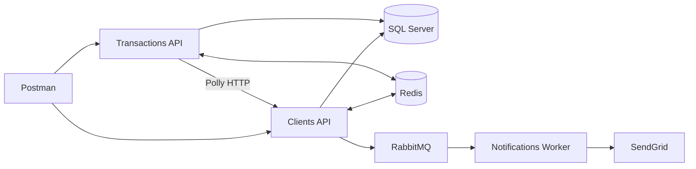
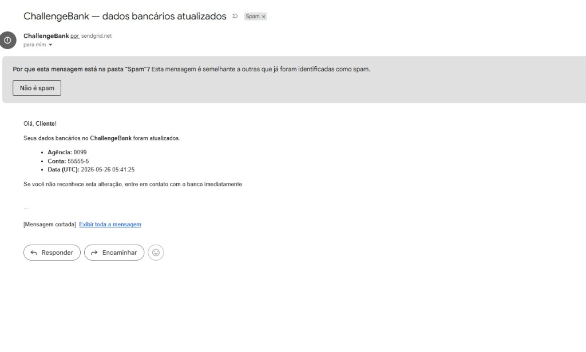

# ChallengeBank — Microsserviços Bancários


Solução em **C# 12** / **.NET 8** com **Clean Architecture**, **SOLID** e **dois microsserviços** (Clientes e Transferências), cada um com API e deploy independentes, compartilhando o banco SQL Server por schema.


## Estrutura da solução


```

ChallengeBank/

├── src/

│   ├── BuildingBlocks/              # Abstrações compartilhadas (DDD + CQRS)

│   ├── Shared/

│   │   └── ChallengeBank.Api.Shared # Envelope, JWT, middleware
│   │   └── ChallengeBank.Contracts  # Contratos (eventos/integrações)

│   └── Services/

│       ├── Clients/

│       │   ├── Domain / Application / Infrastructure

│       │   └── ChallengeBank.Clients.API      # http://localhost:5101

│       └── Transactions/

│           ├── Domain / Application / Infrastructure

│           └── ChallengeBank.Transactions.API # http://localhost:5102

│               └── HTTP → Clients (Polly: Retry, Circuit Breaker, Timeout)

│       └── Notifications/

│           └── ChallengeBank.Notifications.Worker # Consumer RabbitMQ + e-mail SendGrid

├── tests/

└── challengerbank/                  # SQL Server em container (opcional)

```


## Banco de dados


Um único banco **`ChallengeBank`** no SQL Server, com schemas separados:


| Schema | Tabelas |

|--------|---------|

| `clients` | `Clients` |

| `transactions` | `Transfers` |


Connection string: `ChallengeBankDb` em `appsettings.json` de cada API


## Camadas (Clean Architecture)


| Camada | Responsabilidade |

|--------|------------------|

| **Domain** | Entidades, enums, regras de negócio, interfaces de repositório |

| **Application** | Commands/Queries (CQRS), handlers, DTOs, `Result` pattern |

| **Infrastructure** | EF Core, `DbContext`, repositórios, migrations |

| **API** | Controllers, DI, Swagger, health checks (um host por microsserviço) |


## Pré-requisitos


- [.NET 8 SDK](https://dotnet.microsoft.com/download/dotnet/8.0)

- **SQL Server LocalDB** (padrão) ou **ChallengerBank** — ver `challengerbank/README.md`
- **Redis** e **RabbitMQ** (opcional local; no Docker já sobe junto)


## Documentação

- [ARQUITETURA-FLUXO.md](docs/ARQUITETURA-FLUXO.md) — **fluxogramas** (componentes, sequências, Gitflow)
- [MESSAGERIA-RABBITMQ.md](docs/MESSAGERIA-RABBITMQ.md) — mensageria e justificativa assíncrona
- [SENDGRID.md](docs/SENDGRID.md) — e-mail de notificação (SendGrid)
- [RESILIENCIA-POLLY.md](docs/RESILIENCIA-POLLY.md) — Polly entre microsserviços

## Arquitetura (visão geral)

Dois microsserviços HTTP + worker em background, banco único por schema, Redis e RabbitMQ. Detalhes, diagramas e exemplos de sequência: **[docs/ARQUITETURA-FLUXO.md](docs/ARQUITETURA-FLUXO.md)**.



### Controle de versão (Gitflow)

Cada entrega em **branch de feature** com **Pull Request** para `main`:

| PR | Conteúdo |
|----|----------|
| #3 | Microsserviços separados + Polly (Retry, Circuit Breaker, Timeout) |
| #4 | Redis (cache + anti-duplicata), RabbitMQ, worker de notificações |
| #5 | E-mail SendGrid (`INotificationService`) |

## Como executar


Suba **os dois microsserviços** (Transferências depende de Clientes via HTTP/HTTPS).

**HTTPS (recomendado):** perfil `https` — Clientes `https://localhost:7101`, Transferências `https://localhost:7102`. Na primeira vez: `dotnet dev-certs https --trust`.


### Opção A — LocalDB (padrão)


```bash

sqllocaldb start MSSQLLocalDB

dotnet dev-certs https --trust

# (Opcional) Redis + RabbitMQ local via Docker
# cd challengerbank && docker compose up -d redis rabbitmq

# Terminal 1 — Clientes

dotnet run --project src/Services/Clients/ChallengeBank.Clients.API --launch-profile https


# Terminal 2 — Transferências

dotnet run --project src/Services/Transactions/ChallengeBank.Transactions.API --launch-profile https

```


### Opção B — Docker (SQL + 2 APIs)


```bash

cd challengerbank && docker compose up -d --build

```


| API | HTTPS |
|-----|-------|
| Clientes | https://localhost:7101/swagger |
| Transferências | https://localhost:7102/swagger |

Detalhes: [challengerbank/README.md](challengerbank/README.md)


### Opção C — SQL no Docker + APIs no Visual Studio


```bash

cd challengerbank && docker compose up -d sqlserver

dotnet run --project src/Services/Clients/ChallengeBank.Clients.API --launch-profile ChallengerBank

dotnet run --project src/Services/Transactions/ChallengeBank.Transactions.API --launch-profile ChallengerBank

```


No Visual Studio: perfil **https** ou **ChallengerBank** em cada API (solution com os dois projetos). Detalhes em `challengerbank/README.md`.


Em **Development** e **ChallengerBank**, as migrations são aplicadas automaticamente ao iniciar a API.


**Instância SQL Server nativa:** copie `appsettings.Local.example.json` → `appsettings.Local.json` em cada API (se necessário).


### Migrations (manual, se necessário)


```bash

dotnet ef database update -p src/Services/Clients/ChallengeBank.Clients.Infrastructure -s src/Services/Clients/ChallengeBank.Clients.API

dotnet ef database update -p src/Services/Transactions/ChallengeBank.Transactions.Infrastructure -s src/Services/Transactions/ChallengeBank.Transactions.API

```


> `dotnet tool install --global dotnet-ef`


### 3. Rodar a API (Visual Studio 2022)


| Recurso | URL |

|---------|-----|

| Swagger Clientes (HTTPS) | https://localhost:7101/swagger |

| Swagger Transferências (HTTPS) | https://localhost:7102/swagger |

| HTTP (redirect) | :5101 / :5102 |


### 4. Testes


```bash

dotnet test

```


Inclui testes de **domínio** e **integração entre microsserviços** (`tests/Integration/ChallengeBank.Microservices.IntegrationTests`) — **22 testes** com `WebApplicationFactory` ligando as duas APIs.

## Cache (Redis) — Clientes

O `GET /api/clients/{id}` usa cache Redis com TTL (padrão: 120s) e **invalidação no PATCH**.

Configuração (Clients API):

- `Redis:ConnectionString`
- `Redis:KeyPrefix` (opcional)

Em ambiente `Testing`, o cache é desabilitado.


## Formato de resposta (envelope)

Todas as rotas da API (exceto `/health`) retornam:

```json
{
  "Status": 200,
  "Message": "Cliente consultado com sucesso.",
  "Trace": "0HN7...",
  "Data": { }
}
```

Propriedades em inglês (`Status`, `Message`, `Trace`, `Data`); textos de `Message` em português. Erros **401**, **403**, **404**, **409** e **400** usam o mesmo envelope (ex.: transferência inexistente informa o id).

## Autenticação (JWT + RBAC)


| Usuário | Senha | Role |
|---------|-------|------|
| `user` | `User@123` | User |
| `admin` | `Admin@123` | Admin |


1. `POST /api/auth/login` com `{ "username", "password" }` → retorna `accessToken`
2. Envie `Authorization: Bearer {accessToken}` nas demais rotas (exceto `/health` e login)


**RBAC nas rotas existentes:**

| Rota | User | Admin |
|------|------|-------|
| POST/GET `/api/clients` | Sim | Sim |
| PATCH `/api/clients/{id}` | Não (403) | Sim |
| POST/GET `/api/transfers` | Sim | Sim |
| GET `/api/transfers/user/{userId}` | Não (403) | Sim |
| GET `/health` | Anônimo | Anônimo |


## Anti-duplicata de transferências (Redis)

O `POST /api/transfers` registra no Redis a combinação **remetente + destinatário + valor** por **5 minutos** (`Redis:TransferDuplicateWindowMinutes`). Uma segunda tentativa idêntica retorna **409 Conflict**.

Configuração na API de Transferências: `Redis:ConnectionString`, `Redis:KeyPrefix`, `Redis:TransferDuplicateWindowMinutes`.

No Postman: execute **Create Transfer** e em seguida **Create Transfer - duplicata Redis (409)**.

## Comunicação entre microsserviços (Polly)

`POST /api/transfers` valida remetente/destinatário com `GET /api/clients/{id}` na API de Clientes (`ClientsService:BaseUrl`). Polly aplica **Timeout**, **Retry** e **Circuit Breaker** — ver [docs/RESILIENCIA-POLLY.md](docs/RESILIENCIA-POLLY.md).

## Mensageria (RabbitMQ) — bankingDetails atualizado

Quando `bankingDetails` é alterado no `PATCH /api/clients/{id}`, o serviço publica `ClientBankingDetailsUpdatedEvent` no exchange `challengebank.events` (routing key `clients.bankingdetails.updated`).

O `ChallengeBank.Notifications.Worker` consome a mensagem e envia **e-mail via SendGrid** (`INotificationService`). Sem API Key configurada, apenas registra no log.

**Por que assíncrono**, diagrama e validação: [docs/MESSAGERIA-RABBITMQ.md](docs/MESSAGERIA-RABBITMQ.md). **Configuração SendGrid:** [docs/SENDGRID.md](docs/SENDGRID.md) (credenciais via `challengerbank/.env` — não versionado; use [challengerbank/.env.example](challengerbank/.env.example)).

### Evidência de teste (SendGrid)

Fluxo validado: Postman → **Mensageria RabbitMQ (3 passos)** → `PATCH` alterando `bankingDetails` → worker → SendGrid → caixa de entrada.

O e-mail de notificação foi entregue com sucesso. Em ambiente de teste com **Single Sender** (Gmail + SendGrid gratuito), a mensagem pode ir para a pasta **Spam** — isso é esperado e **não indica falha** da aplicação. Causas comuns:

| Motivo | Explicação |
|--------|------------|
| Remetente novo | Pouca reputação do endereço no SendGrid |
| Conteúdo “bancário” | Filtros anti-phishing em provedores gratuitos |
| Sem domínio autenticado | SPF/DKIM completos exigem domínio próprio (produção) |

Para demonstração ou correção, use [SendGrid Activity](https://app.sendgrid.com/email_activity) (status **Delivered**) e o log do worker: `E-mail SendGrid enviado`.



*Assunto: «ChallengeBank — dados bancários atualizados» · remetente via `sendgrid.net` · corpo com agência, conta e data UTC.*

## Postman


Importe `docs/postman/ChallengeBank.postman_collection.json` e um environment:

| Environment | Quando usar |
|-------------|-------------|
| **ChallengeBank - Docker (HTTPS)** | `docker compose up` — portas 7101/7102 |
| **ChallengeBank - Local (HTTPS)** | APIs via `dotnet run` local |

Variáveis: `baseUrlClients`, `baseUrlTransfers`. Desative verificação SSL no Postman (cert dev). Pastas: **Fluxo completo**, **Mensageria RabbitMQ**, **Create Transfer - duplicata Redis**.


## Endpoints


- `POST /api/auth/login` — obter JWT

- `POST /api/clients` — cadastrar cliente (opcional: `address`, `bankingDetails`) — requer JWT

- `GET /api/clients/{id}` — consultar cliente (com dados bancários)

- `PATCH /api/clients/{id}` — atualização parcial (`name`, `email`, `address`, `bankingDetails`)

- `POST /api/transfers` — criar transferência (`senderUserId`, `receiverUserId`, `amount`, `description`) → retorna `{ id, status }`

- `GET /api/transfers/{id}` — detalhe da transferência

- `GET /api/transfers/user/{userId}` — lista de transferências do usuário

- `GET /health` — health check por microsserviço


## Stack


| Item | Tecnologia |

|------|------------|

| Linguagem | C# 12 |

| Framework | .NET 8 |

| Banco | SQL Server (banco único `ChallengeBank`) |

| ORM | Entity Framework Core 8 |

| Resiliência HTTP | Microsoft.Extensions.Http.Resilience (Polly) |


