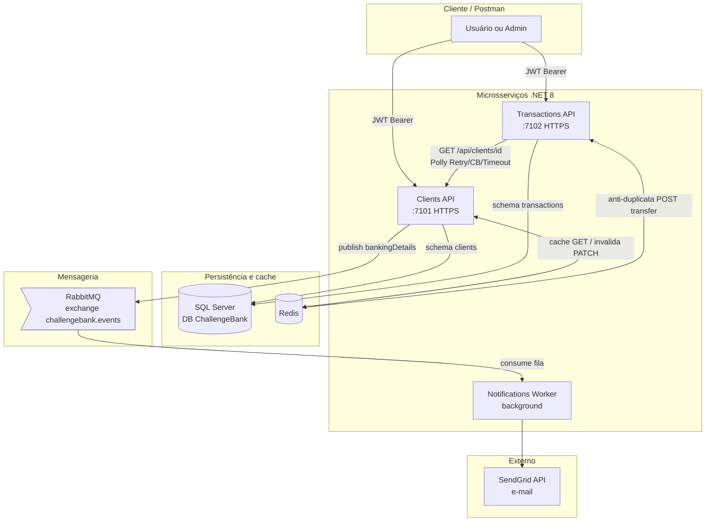
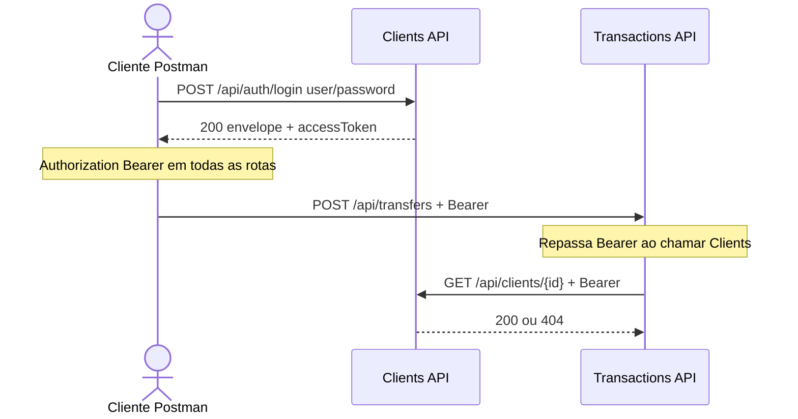
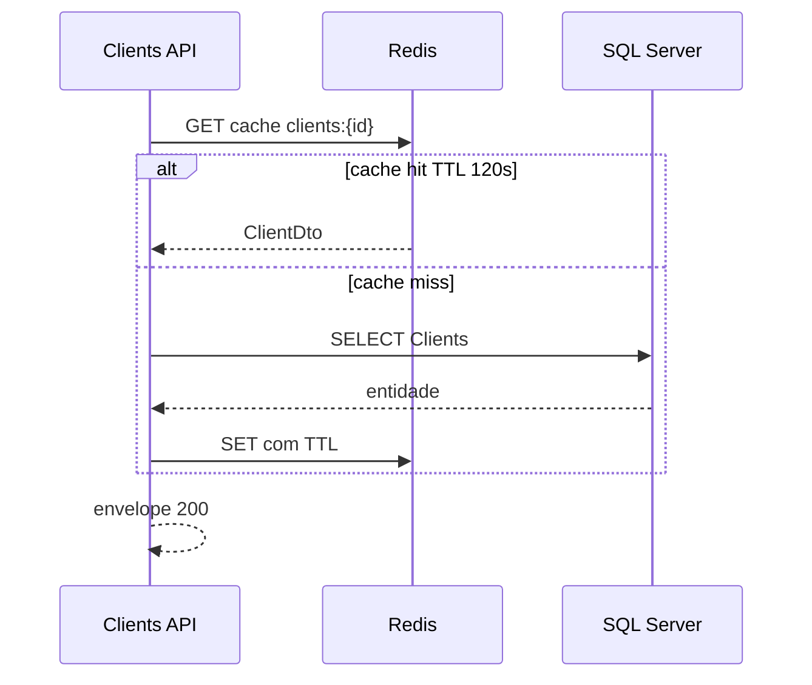
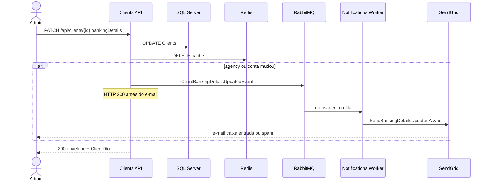
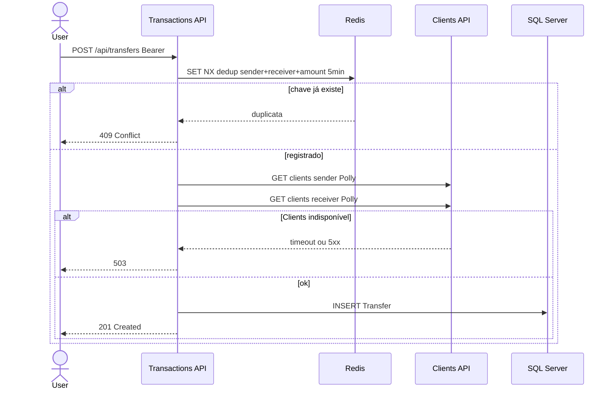
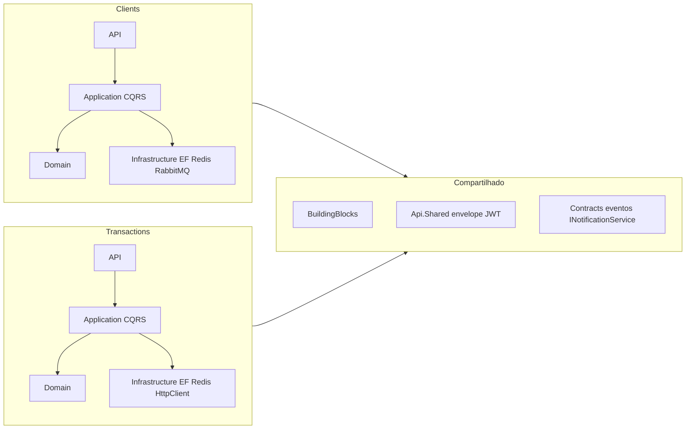
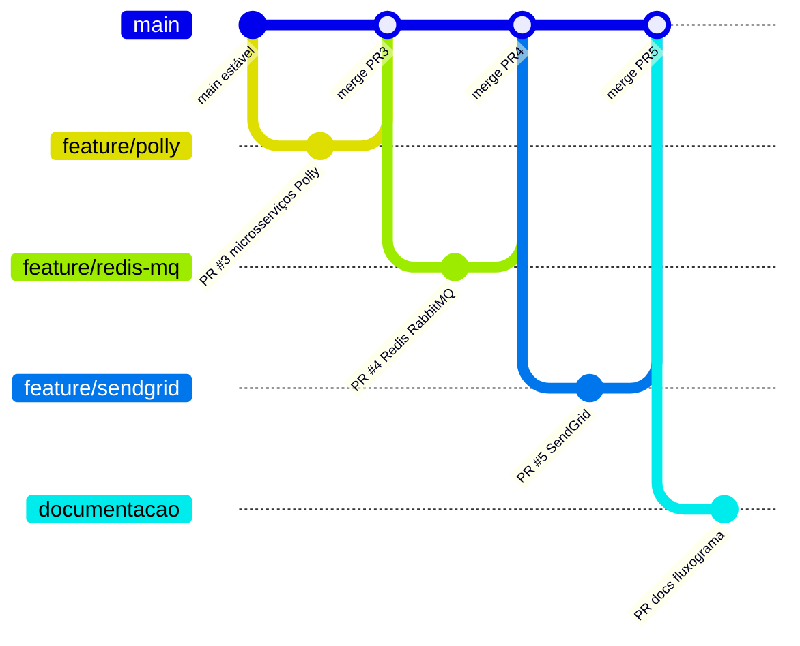

# Arquitetura e fluxos — ChallengeBank

Visão do sistema **como está na `main`**: dois microsserviços HTTP, worker de notificações, SQL Server, Redis, RabbitMQ e SendGrid.

---

## 1. Visão de componentes (infraestrutura)

| Componente | Porta / acesso (Docker) | Papel |
|------------|---------------------------|--------|
| **Clients API** | https://localhost:7101 | Cadastro, consulta, PATCH cliente |
| **Transactions API** | https://localhost:7102 | Transferências P2P |
| **Notifications Worker** | — (sem HTTP público) | Consome RabbitMQ, envia e-mail |
| **SQL Server** | localhost:14333 | Banco único, schemas `clients` e `transactions` |
| **Redis** | localhost:6379 | Cache cliente + deduplicação de transferência |
| **RabbitMQ** | :5672 / UI :15672 | Eventos assíncronos |
| **SendGrid** | API HTTPS | Entrega de e-mail |

---

## 2. Autenticação (JWT compartilhado)

As duas APIs usam o mesmo `Jwt:Audience` = `ChallengeBank`. Login em qualquer uma gera token válido nas duas.

| Usuário | Senha | Role | PATCH cliente | Lista transfers/user |
|---------|-------|------|---------------|----------------------|
| `user` | `User@123` | User | 403 | 403 |
| `admin` | `Admin@123` | Admin | 200 | 200 |

---

## 3. Clientes — GET com cache Redis

**Invalidação:** no `PATCH /api/clients/{id}` a chave do cliente é removida do Redis.

---

## 4. Clientes — PATCH bankingDetails (síncrono + assíncrono)

| Etapa | Síncrono? | Detalhe |
|-------|-----------|---------|
| Validação + SQL + resposta PATCH | Sim | Usuário recebe DTO atualizado |
| Publicação RabbitMQ | Sim na API, rápida | Não espera o e-mail |
| E-mail SendGrid | Assíncrono | Worker separado — ver [MESSAGERIA-RABBITMQ.md](./MESSAGERIA-RABBITMQ.md) |

**Exchange:** `challengebank.events` · **Routing key:** `clients.bankingdetails.updated` · **Fila:** `notifications.clients.bankingdetails.updated`

---

## 5. Transferências — POST com Polly e anti-duplicata Redis

Políticas HTTP (Transfers → Clients): **Timeout**, **Retry**, **Circuit Breaker** — [RESILIENCIA-POLLY.md](./RESILIENCIA-POLLY.md).

---

## 6. Camadas por microsserviço (Clean Architecture)

---

## 7. Controle de versão (Gitflow simplificado)

| PR | Tema |
|----|------|
| #3 | Desvinculação APIs + Polly |
| #4 | Redis cache/dedup + RabbitMQ + worker |
| #5 | SendGrid e-mail |
| docs | Fluxograma, evidências README |

Fluxo: **branch de feature → Pull Request → merge na `main`**.

---

## 8. Mapa rápido endpoint → sistema

| Endpoint | API | SQL | Redis | RabbitMQ | SendGrid |
|----------|-----|-----|-------|----------|----------|
| POST /api/auth/login | ambas | — | — | — | — |
| POST/GET /api/clients | Clients | ✓ | GET cache | — | — |
| PATCH /api/clients/{id} | Clients | ✓ | invalida | ✓ se banking mudou | via worker |
| POST /api/transfers | Transfers | ✓ | dedup | — | — |
| GET /api/transfers/* | Transfers | ✓ | — | — | — |
| GET /health | ambas | ✓ check | — | — | — |

---

## 9. Documentação relacionada

| Documento | Conteúdo |
|-----------|----------|
| [README.md](../README.md) | Execução, endpoints, credenciais |
| [challengerbank/README.md](../challengerbank/README.md) | Docker Compose |
| [MESSAGERIA-RABBITMQ.md](./MESSAGERIA-RABBITMQ.md) | Por que assíncrono |
| [SENDGRID.md](./SENDGRID.md) | Configuração e-mail |
| [RESILIENCIA-POLLY.md](./RESILIENCIA-POLLY.md) | Polly |
| [postman/](./postman/) | Collection + environments Local/Docker |

---

## 10. Cobertura da documentação vs. sistema (auditoria)

| Tópico do desafio | Documentado? | Onde |
|-------------------|:------------:|------|
| Dois microsserviços + Clean Architecture | Sim | README, §6 deste doc |
| Clientes POST/GET/PATCH + bankingDetails | Sim | README endpoints, §3–4 |
| Transferências P2P POST/GET/lista | Sim | README, §5 |
| JWT + RBAC | Sim | README, §2 |
| Envelope + erros PT (400/401/403/404/409/503) | Sim | README |
| Redis cache GET cliente | Sim | README, §3 |
| Redis anti-duplicata transferência 5 min | Sim | README, §5, challengerbank README |
| RabbitMQ + evento bankingDetails | Sim | MESSAGERIA, §4 |
| SendGrid + INotificationService | Sim | SENDGRID, README evidência |
| Polly Retry/CB/Timeout | Sim | RESILIENCIA-POLLY, §5 |
| Docker Compose stack completa | Sim | challengerbank/README |
| Postman E2E | Sim | README Postman, collection |
| Testes `dotnet test` | Sim | README (22 testes) |
| Fluxograma arquitetura | Sim | Este documento |
| Gitflow / PRs | Sim | README, §7 |
| **Foto perfil Azure Blob** | Não | Fora do escopo implementado |
| **CI GitHub Actions** | Não | Não implementado |
| **Deploy Azure / API Gateway** | Não | Não implementado |
| **Serilog estruturado** | Não | Logging padrão ASP.NET |
| **Board de tarefas / e-mail Loomi** | Não | Processo externo ao repo |

**Conclusão:** a documentação do repositório cobre **100% do que foi implementado** no código. Itens não cobertos são **funcionalidades não entregues** (P2) ou **entrega processual** (board, e-mail avaliador), não lacunas de doc do que existe.
